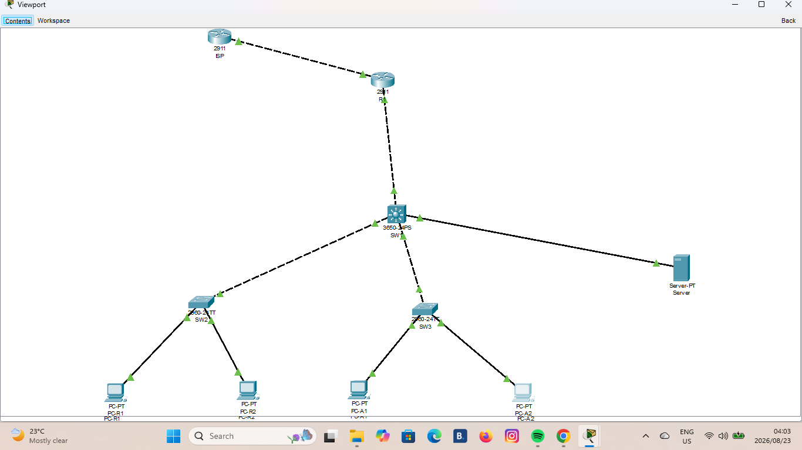

# CMPG 325 - Network Design Project
## Mmabatho Water Research Laboratory (CLI-108)

| **Project Details** | |
|---------------------|---|
| **Project ID** | CMPG325-2026-108 |
| **Client ID** | CLI-108 |
| **Organisation** | Mmabatho Water Research Laboratory |
| **Industry** | Research |
| **Student Name** | Israel Phale |
| **Student Number** | [41511425] |
| **Date** | 23 August 2026 |

---

## 📋 Client Requirements

### Organisation Background
Mmabatho Water Research Laboratory is a research organisation requiring a modern computer network to support their operations. The network must facilitate secure data exchange between departments while protecting confidential customer records.

### Key Requirements
1. **Network Design:** Develop a computer network using the assigned addressing block `10.41.0.0/16`
2. **IPv6 Dual-Stack:** Implement and demonstrate IPv6 addressing and routing alongside IPv4 (Assigned Networking Challenge)
3. **Security:** Control access to confidential customer records (Design Constraint)
4. **File Server:** Deploy a new application/file server reachable only by authorised departments (Change Request CR4)
5. **Connectivity:** Ensure successful data exchange between appropriate network nodes
6. **Simulation:** Provide a working, testable Cisco Packet Tracer implementation

---

## 🌐 IPv6 Addressing Strategy (Assigned Networking Challenge)

### Why IPv6 Dual-Stack?

The project requires **IPv6 dual-stack addressing and routing**. This means all devices must have **both an IPv4 and IPv6 address** and be able to communicate using both protocols simultaneously.

**Why is this appropriate for Mmabatho Water Research Laboratory?**

| Reason | Explanation |
|--------|-------------|
| **Future-Proofing** | IPv4 address exhaustion is a reality. Dual-stack prepares the network for the future |
| **Modern Standards** | Research institutions often collaborate internationally requiring modern IP standards |
| **Security** | IPv6 was designed with security in mind (IPsec built-in) |
| **Skill Demonstration** | Shows advanced networking capability (this is the assigned challenge) |

### IPv6 Address Type: Unique Local Addresses (ULA)

The project brief **only provided an IPv4 block (`10.41.0.0/16`)**. No IPv6 block was given, so I had to create my own IPv6 addressing scheme.

**I chose Unique Local Addresses (ULAs) for the following reasons:**

| Comparison | Global Unicast | Unique Local (ULA) | Why ULA for this project? |
|------------|---------------|-------------------|---------------------------|
| **Routable on Internet** | Yes | No (private) | Lab is internal, not public-facing |
| **Equivalent to** | Public IP | IPv4 Private IP (10.x.x.x) | Consistent with assigned IPv4 block |
| **Use Case** | Public websites | Internal networks | Perfect for research lab with confidential records |
| **Example** | `2001:db8:1::/64` | `FD00:108:1:10::/64` | Our design uses ULA |

**ULA Format:** `FDxx:xxxx:xxxx:xxxx::/64`

### How I Constructed the IPv6 Addresses

| Part | Value | Meaning |
|------|-------|---------|
| **Prefix** | `FD00` | ULA prefix (always starts with FD) |
| **Global ID** | `:108:` | Project ID (CLI-108) - ensures uniqueness |
| **Subnet ID** | `:1:` | Site/Network identifier |
| **VLAN ID** | `:VLAN:` | Matches the VLAN number (10, 20, 30, 99) |
| **Host Portion** | `::1` | Gateway address |
| **Subnet Size** | `/64` | Standard for LAN segments |

**Example:** VLAN 10 (Staff) → `FD00:108:1:10::/64`
- `FD00` = ULA prefix
- `108` = Project ID
- `1` = Site ID
- `10` = VLAN 10
- `/64` = Standard subnet size

### Complete IPv6 Addressing Table

| VLAN | VLAN Name | IPv6 Subnet | Gateway | Host Range | Devices |
|------|-----------|-------------|---------|------------|---------|
| 99 | Management | `FD00:108:1:99::/64` | `::1` | `::2` - `::FFFF` | R1, SW1, SW2, SW3 |
| 10 | Staff/Research | `FD00:108:1:10::/64` | `::1` | `::2` - `::FFFF` | PC-R1, PC-R2 |
| 20 | Admin | `FD00:108:1:20::/64` | `::1` | `::2` - `::FFFF` | PC-A1, PC-A2 |
| 30 | Servers | `FD00:108:1:30::/64` | `::1` | `::2` - `::FFFF` | Server (`::10`) |
| WAN | ISP Link | `FD00:108:1:1::/64` | `::1` | `::2` | R1, ISP |

### Why This IPv6 Design is Appropriate

| Design Decision | Why It's Appropriate |
|-----------------|---------------------|
| **ULA addressing** | Internal private network - matches the lab's confidential nature |
| **FD prefix** | Standard ULA format - professional and compliant |
| **108 in address** | Project ID embedded - makes it unique to this client |
| **VLAN ID in subnet** | Easy to identify which subnet belongs to which VLAN |
| **/64 subnets** | Standard for LANs - allows for SLAAC (no DHCPv6 needed) |
| **SLAAC for PCs** | Simplifies administration - PCs auto-configure IPv6 addresses |
| **Static for Server** | Server needs a predictable, fixed address |

### How IPv6 Will Be Configured

| Configuration Step | Command | Purpose |
|-------------------|---------|---------|
| Enable IPv6 routing | `ipv6 unicast-routing` | Allows router to route IPv6 traffic |
| IPv6 on sub-interfaces | `ipv6 address FD00:108:1:10::1/64` | Assigns gateway addresses |
| Enable SLAAC | `ipv6 nd ra-interval 30` | Allows PCs to auto-configure |
| IPv6 ACL | `ipv6 access-list BLOCK-STAFF` | Implements security for confidential records |
| IPv6 routing | `ipv6 route ::/0` | Default route for internet access |

### How IPv6 Will Be Verified

| Verification Method | Command | What It Proves |
|--------------------|---------|---------------|
| Router IPv6 addresses | `show ipv6 interface brief` | IPv6 is configured on router |
| PC IPv6 addresses | `ipconfig` (on PC) | PC has both IPv4 AND IPv6 |
| IPv6 connectivity | `ping FD00:108:1:30::10` | IPv6 communication works |
| IPv6 routing | `show ipv6 route` | IPv6 routing table is correct |
| IPv6 security | Ping from Staff → Server (FAILS) | ACL is blocking unauthorised access |

---

## 🏗️ Physical Topology

### Device Inventory

| Device | Model | Role | Interfaces |
|--------|-------|------|------------|
| R1 | Cisco 2911 | Main Gateway Router | G0/0 (to SW1), G0/1 (to ISP) |
| ISP | Cisco 2911 | Internet Service Provider Router | G0/0 (to R1) |
| SW1 | Cisco 3650 | Core/Distribution Switch | G0/1 (to R1), G0/2 (to SW2), G0/3 (to SW3), G0/4 (to Server) |
| SW2 | Cisco 2960 | Staff Access Switch | G0/1 (to SW1), F0/1-F0/2 (to PCs) |
| SW3 | Cisco 2960 | Admin Access Switch | G0/1 (to SW1), F0/1-F0/2 (to PCs) |
| Server | Server-PT | Application/File Server | FastEthernet (to SW1) |
| PC-R1, PC-R2 | PC-PT | Research Staff Workstations | FastEthernet (to SW2) |
| PC-A1, PC-A2 | PC-PT | Admin Department Workstations | FastEthernet (to SW3) |

### Physical Topology Diagram

---

## 🔄 Logical Topology

### VLAN Structure

| VLAN ID | VLAN Name | Purpose |
|---------|-----------|---------|
| 99 | Management/Native | Network device management |
| 10 | Staff/Research | Research department workstations |
| 20 | Admin | Administrative department |
| 30 | Servers | Application and file servers |

### Routing Design
- **Inter-VLAN Routing:** Router-on-a-Stick (ROAS) configured on R1 using sub-interfaces
- **IPv4 Routing:** Static routing between R1 and ISP
- **IPv6 Routing:** IPv6 unicast routing enabled with static routes

### Security Design
- **Access Control:** Extended ACLs (IPv4 and IPv6) applied on R1 sub-interface G0/0.30
  - Permit traffic from Admin VLAN 20 to Server VLAN 30
  - Deny traffic from Staff VLAN 10 to Server VLAN 30
- **Reasoning:** Protects confidential customer records by restricting server access to authorised departments only

### Logical Topology Diagram
*[Screenshot of logical topology with VLANs and IP addressing to be inserted here]*

---

## 📊 IP Addressing Plan

### IPv4 Addressing

| VLAN | Subnet | Gateway | DHCP Range | Devices |
|------|--------|---------|------------|---------|
| Management (99) | 10.41.99.0/24 | 10.41.99.1 | N/A (Static) | R1, SW1, SW2, SW3 |
| Staff (10) | 10.41.10.0/24 | 10.41.10.1 | 10.41.10.10-254 | PC-R1, PC-R2 |
| Admin (20) | 10.41.20.0/24 | 10.41.20.1 | 10.41.20.10-254 | PC-A1, PC-A2 |
| Servers (30) | 10.41.30.0/24 | 10.41.30.1 | N/A (Static) | Server: 10.41.30.10 |
| WAN Link | 10.41.1.0/30 | 10.41.1.1 | N/A (Static) | R1, ISP |

### IPv6 Addressing (Unique Local Addresses - ULA)

| VLAN | IPv6 Subnet | IPv6 Gateway | IPv6 Devices |
|------|-------------|--------------|--------------|
| Management (99) | FD00:108:1:99::/64 | FD00:108:1:99::1 | R1, SW1, SW2, SW3 |
| Staff (10) | FD00:108:1:10::/64 | FD00:108:1:10::1 | PC-R1, PC-R2 (SLAAC) |
| Admin (20) | FD00:108:1:20::/64 | FD00:108:1:20::1 | PC-A1, PC-A2 (SLAAC) |
| Servers (30) | FD00:108:1:30::/64 | FD00:108:1:30::1 | Server: FD00:108:1:30::10 |
| WAN Link | FD00:108:1:1::/64 | FD00:108:1:1::1 | R1, ISP |

### Device IP Assignments

| Device | Interface | IPv4 Address | IPv6 Address |
|--------|-----------|--------------|--------------|
| R1 | G0/0.99 | 10.41.99.1/24 | FD00:108:1:99::1/64 |
| R1 | G0/0.10 | 10.41.10.1/24 | FD00:108:1:10::1/64 |
| R1 | G0/0.20 | 10.41.20.1/24 | FD00:108:1:20::1/64 |
| R1 | G0/0.30 | 10.41.30.1/24 | FD00:108:1:30::1/64 |
| R1 | G0/1 | 10.41.1.1/30 | FD00:108:1:1::1/64 |
| ISP | G0/0 | 10.41.1.2/30 | FD00:108:1:1::2/64 |
| Server | NIC | 10.41.30.10/24 | FD00:108:1:30::10/64 |
| PC-R1 | NIC | DHCP | SLAAC |
| PC-R2 | NIC | DHCP | SLAAC |
| PC-A1 | NIC | DHCP | SLAAC |
| PC-A2 | NIC | DHCP | SLAAC |

---

## 🔐 Security Implementation

### Design Constraint: Confidential Customer Records
To address the requirement that "customer records are confidential - access must be controlled," the following measures are implemented:

1. **VLAN Segmentation:** Departments are separated into distinct VLANs
2. **Access Control Lists (ACLs):** Extended ACLs on R1 restrict server access
   - **ACL 100 (IPv4):**
     - `permit ip 10.41.20.0 0.0.0.255 10.41.30.0 0.0.0.255` (Admin to Server)
     - `deny ip 10.41.10.0 0.0.0.255 10.41.30.0 0.0.0.255` (Staff to Server)
     - `permit ip any any` (All other traffic)
   - **IPv6 ACL (BLOCK-STAFF):**
     - `deny ipv6 FD00:108:1:10::/64 any host FD00:108:1:30::10` (Staff to Server)
     - `permit ipv6 any any` (All other traffic)

### Change Request CR4: New Application/File Server
- Server deployed in VLAN 30
- ACLs ensure only Admin department (VLAN 20) can access the server
- Research staff (VLAN 10) are blocked - protecting confidential data

---

## 📁 Repository Structure

---

## 🧪 Testing Plan *(To be executed in Milestone 2)*

This section outlines the testing strategy that will be executed once the network is fully configured in Milestone 2. Test results and screenshots will be added at that time.

### Planned IPv4 Connectivity Tests
| Test | Source | Destination | Expected Result |
|------|--------|-------------|-----------------|
| Intra-VLAN | PC-R1 | PC-R2 | ✅ Successful ping |
| Inter-VLAN | PC-R1 | PC-A1 | ✅ Successful ping |
| Server Access (Admin) | PC-A1 | Server | ✅ Successful ping |
| Server Access (Staff) | PC-R1 | Server | ❌ **Failed ping (ACL Block)** |
| Internet Access | PC-R1 | ISP | ✅ Successful ping |

### Planned IPv6 Connectivity Tests
| Test | Source | Destination | Expected Result |
|------|--------|-------------|-----------------|
| Intra-VLAN | PC-R1 | PC-R2 | ✅ Successful ping |
| Inter-VLAN | PC-R1 | PC-A1 | ✅ Successful ping |
| Server Access (Admin) | PC-A1 | Server | ✅ Successful ping |
| Server Access (Staff) | PC-R1 | Server | ❌ **Failed ping (ACL Block)** |
| Internet Access | PC-R1 | ISP | ✅ Successful ping |

### IPv6 Verification Commands *(To be executed in Milestone 2)*
| Command | Purpose |
|---------|---------|
| `show ipv6 interface brief` | Verify all IPv6 addresses on R1 |
| `show ipv6 route` | Verify IPv6 routing table |
| `show ipv6 access-list` | Verify IPv6 ACL is applied |
| `ipconfig` (on each PC) | Verify PCs have both IPv4 AND IPv6 |
| `ping FD00:108:1:30::10` | Test IPv6 connectivity to Server |

*[Screenshots of all tests to be added in Milestone 2]*

---

## 📅 Milestone Progress

- [x] **Milestone 1** - Client Design Review (28 August 2026) ✅
- [ ] **Milestone 2** - Client Implementation Review (2 October 2026)
- [ ] **Final Submission** - Complete Project Delivery (16 October 2026)

---

## 📝 Design Justification

### Why VLANs?
VLANs provide logical segmentation, improving security and reducing broadcast traffic. Separating Research, Admin, and Servers into different VLANs is essential for access control.

### Why Router-on-a-Stick?
ROAS is cost-effective, using a single physical router interface to route between multiple VLANs. Ideal for small-to-medium networks like this lab.

### Why IPv6 Dual-Stack?
IPv6 dual-stack ensures:
- Future-proofing (IPv4 address exhaustion)
- Compliance with modern networking standards
- Demonstrates advanced networking skills (the assigned challenge)
- Maintains compatibility with existing IPv4 applications

### Why Unique Local Addresses (ULA) for IPv6?
ULAs are the IPv6 equivalent of IPv4 private addresses (10.x.x.x, 192.168.x.x). Since this is a private research lab with no need for public internet-facing IPv6 addresses, ULA is the most appropriate choice.

### Why ACLs?
Extended ACLs provide granular traffic filtering at Layer 3, allowing us to permit/deny based on source/destination IP. Essential for enforcing the "confidential records" constraint.

### Why SLAAC?
Stateless Address Autoconfiguration allows PCs to auto-configure IPv6 addresses without a DHCPv6 server, simplifying administration. The router advertises the network prefix and PCs generate their own host portion.

---

## 🔗 GitHub Repository
**URL:** https://github.com/Israel-phale/CMPG325-Project-CLI108

---

## 📌 Submission Status

**This document is submitted for:**
- **Milestone:** Milestone 1 - Client Design Review
- **Client:** Mmabatho Water Research Laboratory (CLI-108)
- **Project ID:** CMPG325-2026-108
- **Student:** Israel Phale
- **Student Number:** [41511425]
- **Submission Date:** 23 August 2026
- **Status:** ✅ Complete - Ready for Review

---

*This document contains all required elements for Milestone 1 as per the project brief: Client Requirements, Physical Topology, Logical Topology, IP Addressing Plan, and Initial GitHub Repository.*
